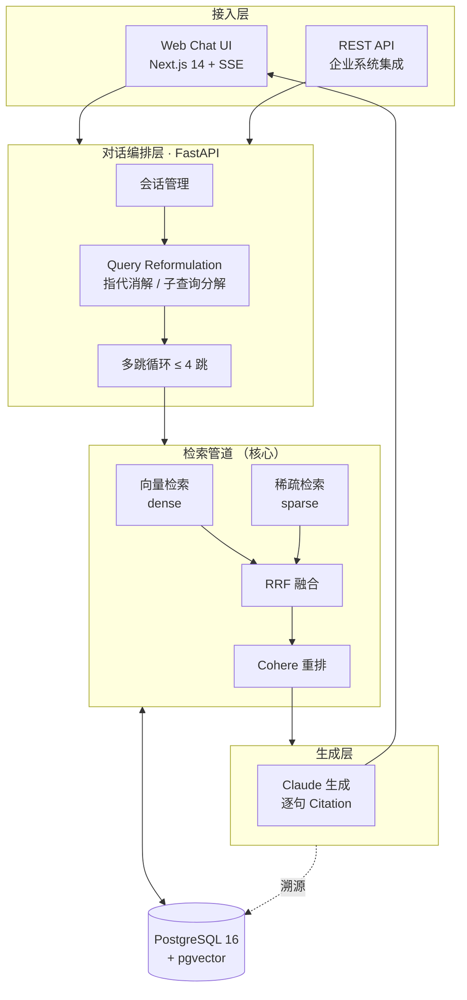
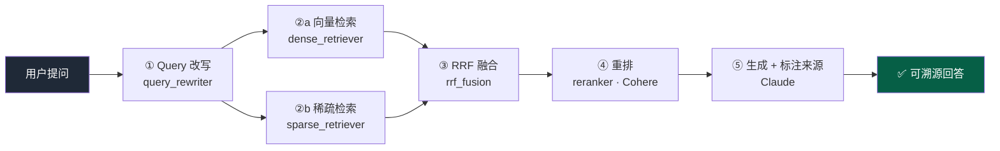
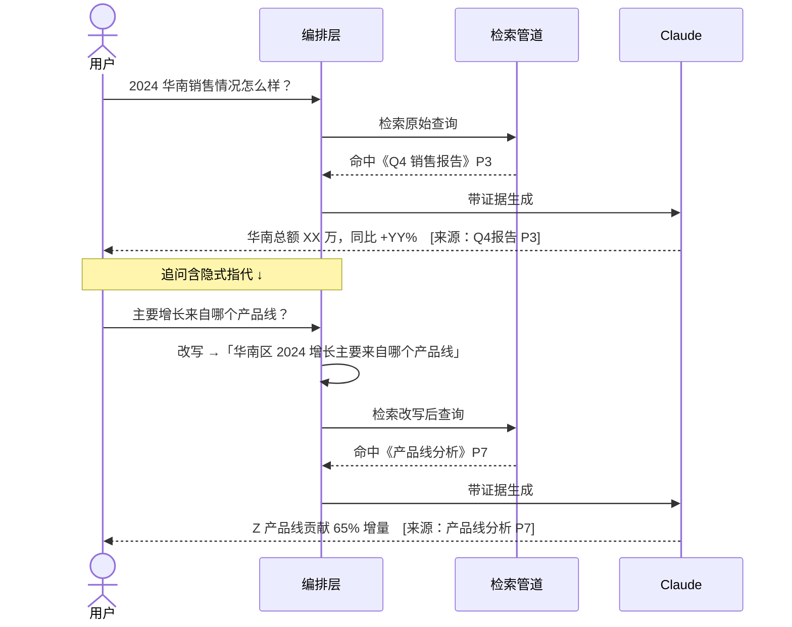
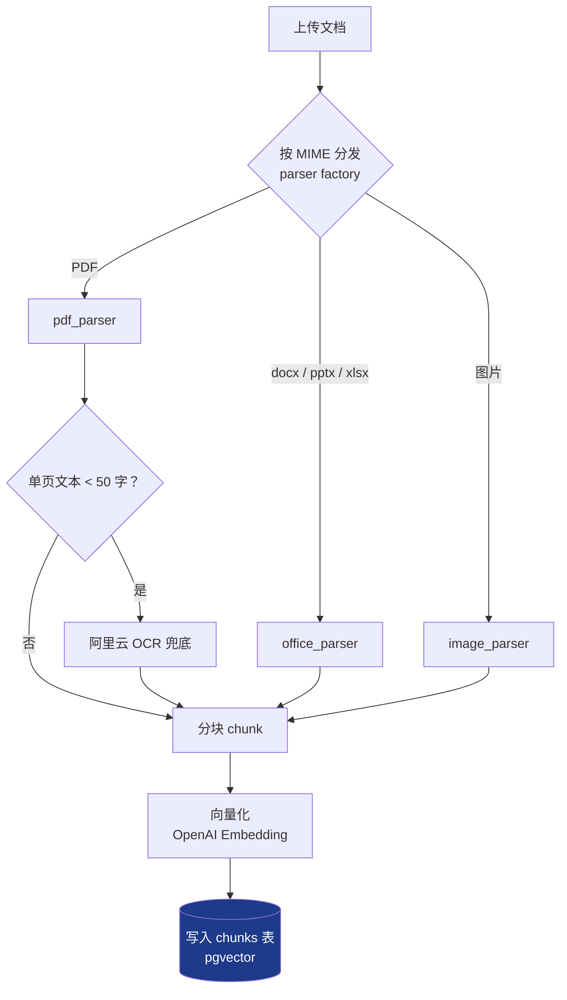
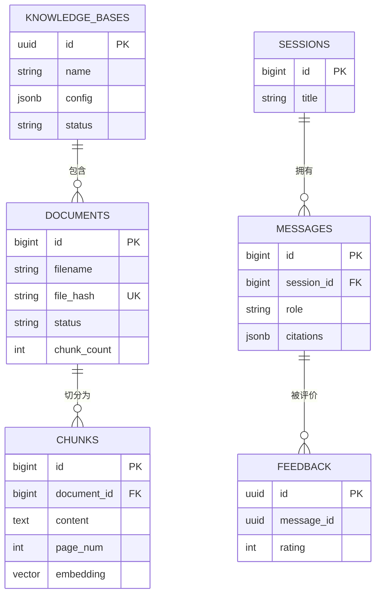
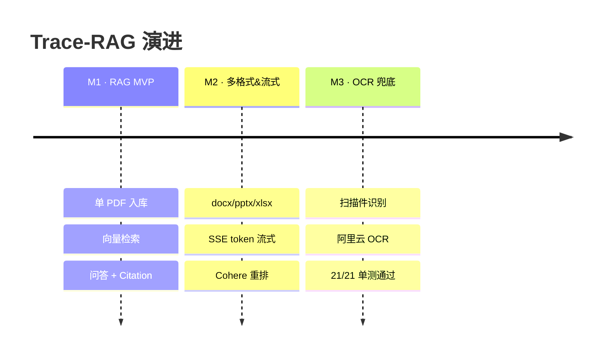

<div align="center">

# 🔍 Trace-RAG

**可审计、可溯源的企业级多模态 RAG 系统**

_每一个回答都能追溯到原始文档的具体位置 —— 不是聊天机器人，是企业知识供应链_

<br/>


</div>

---

## ✨ 它解决什么问题

企业内部堆了海量多模态文档（PDF / Word / PPT / Excel / 扫描件），关键词搜索看不懂语义、更不会跨文档推理。Trace-RAG 让员工**用自然语言提问**，拿到**有出处、可追责**的精准回答，并支持**串联式多轮追问**。

| 能力 | 说明 |
|------|------|
| 🧠 **串联式多轮问答** | 自动消解「它/这个/那条」等指代，把追问改写成独立完整查询，最多 4 跳推理 |
| 🔗 **逐句溯源** | 每个事实标注来源文档 + 页码（`[来源：Q4报告 P3]`），错误可追责 |
| 🗂️ **跨格式检索** | PDF / Word / PPT / Excel / 图片，答案可横跨多种格式综合 |
| 🔍 **混合检索** | 向量 + 稀疏双路召回 → RRF 融合 → Cohere 重排，比单路向量更稳 |
| 👁️ **扫描件兜底** | 低文本 PDF 自动调阿里云 OCR，老合同/扫描政策也能被检索 |
| ⚡ **流式输出** | SSE token 级返回，长答案边生成边显示 |

---

## 🏗️ 系统架构



---

## 🔎 检索管道（系统的护城河）

单路向量检索容易漏召回。Trace-RAG 走**双路召回 + 融合 + 重排**的工业级链路：



---

## 💬 串联式多轮问答（核心场景）

追问里的指代会被**改写成独立完整查询**再进检索，所以上下文能层层累积：



---

## 📥 文档入库管道



> 去重靠 `file_hash` 唯一约束；OCR 单页失败仅告警跳过，不阻塞整篇入库。

---

## 🗃️ 数据模型



> 另有 `retrieval_logs` 审计表，记录每次检索的查询、命中与耗时，支撑「可追责」。

---

## 🧱 技术栈

| 层 | 技术选型 |
|----|---------|
| **前端** | Next.js 14 · React 18 · TypeScript · SSE 流式渲染 |
| **后端** | FastAPI · SQLAlchemy 2.0 · Pydantic · structlog · uv |
| **数据库** | PostgreSQL 16 · pgvector · Alembic 迁移 |
| **检索/生成** | OpenAI Embedding · Claude（生成）· Cohere（重排） |
| **文档解析** | pypdf · python-docx · python-pptx · openpyxl · pypdfium2 |
| **OCR** | 阿里云通用文字识别（扫描件兜底） |
| **部署** | Docker Compose · Makefile |

---

## 🚀 快速开始

> 前置：Docker · Python 3.11+ · Node 18+ · [uv](https://github.com/astral-sh/uv)

```bash
# 1) 配置密钥
cp rag-backend/.env.example rag-backend/.env      # 填 OPENAI / ANTHROPIC / COHERE（OCR 可选）
cp rag-frontend/.env.local.example rag-frontend/.env.local

# 2) 起数据库（pgvector/pg16，宿主机端口 5435）
make up

# 3) 装依赖 + 迁移
cd rag-backend && uv sync && cd ..
make migrate

# 4) 起后端（:8088）和前端（:3000）
make dev          # 终端 A
make frontend     # 终端 B
```

打开 **http://localhost:3000** → 在 `/documents` 上传文档，等状态变 `indexed` → 回首页提问。

| 服务 | 地址 |
|------|------|
| 前端 Chat UI | http://localhost:3000 |
| 后端 API | http://localhost:8088 |
| API 文档 (Swagger) | http://localhost:8088/docs |
| PostgreSQL | localhost:5435 |

**所需环境变量**：`OPENAI_API_KEY` · `ANTHROPIC_API_KEY` · `COHERE_API_KEY` · `DATABASE_URL` ·（可选）`ALIYUN_OCR_ACCESS_KEY_ID/SECRET`

---

## 🔌 API 一览

| 方法 | 路径 | 说明 |
|------|------|------|
| `POST` | `/api/v1/documents` | 上传文档并触发入库 |
| `GET` | `/api/v1/documents` | 文档列表 |
| `GET` | `/api/v1/documents/{id}` | 单个文档状态 |
| `POST` | `/api/v1/chat` | 问答（一次性返回） |
| `POST` | `/api/v1/chat/stream` | 问答（SSE 流式） |
| `GET/POST/DELETE` | `/api/v1/knowledge-bases` | 知识库管理 |
| `GET` | `/api/v1/health` | 健康检查 |

---

## 📁 目录结构

```text
trace-rag/
├── rag-backend/                 # FastAPI 后端
│   └── app/
│       ├── api/v1/              # chat / documents / knowledge_bases / health
│       ├── pipeline/
│       │   ├── ingestion/       # 解析 → OCR 兜底 → 分块 → 向量化
│       │   └── retrieval/       # 改写 · dense · sparse · RRF · rerank
│       ├── models/              # SQLAlchemy 数据模型
│       ├── services/parsers/    # pdf / docx / pptx / xlsx
│       └── core/                # 配置、日志
├── rag-frontend/                # Next.js 14 前端
├── deploy/                      # 生产部署
├── docs/                        # PRD · specs · plans · 里程碑交接
├── docker-compose.yml           # 本地基础设施
└── Makefile                     # 一键命令
```

---

## 🗺️ 交付里程碑



- [x] **M1** RAG MVP — 入库、向量检索、带溯源问答
- [x] **M2** 多格式入库 + SSE 流式 + 混合检索重排
- [x] **M3** 扫描件 OCR 兜底（待真实 OCR Key 的 E2E 验收）
- [ ] **M4** 知识库权限 / 多租户、版本降权、评测体系

---

## 🖼️ 界面预览

<!-- 运行截图放到 docs/assets/ 后，把下面占位替换为： -->
> 截图位（上传后替换）：`docs/assets/` ←
> 建议放：文档上传页、多轮问答 + Citation 高亮、来源溯源弹窗。

---

<div align="center">

**Trace-RAG** · 让企业知识「问得到、有出处、可追责」

</div>
